# Story Tree Workflow Diagrams

This document provides visual representations of the key workflows and data structures used by the story-tree skill system.

**Document structure:** Conceptual model → Data storage → Operational workflows

---

## Table of Contents

1. [Definitions](#definitions)
2. [Three-Field Workflow Model](#three-field-workflow-model)
   - Stage Transitions
   - Multi-Faceted Stage Meanings
   - Hold States
   - Disposition States
3. [Database Architecture](#database-architecture)
   - Closure Table Data Structure
   - Closure Table Path Example
   - Node Insertion Process
   - Dynamic Capacity Calculation
4. [Skill Workflows](#skill-workflows)
   - Main Update Workflow
   - Priority Algorithm Decision Flow
   - Git Commit Analysis Process
   - Story Generation Flow

---

## Definitions

| Term | Definition |
|------|------------|
| **Story node** | A unit of work in the hierarchical backlog—can be an epic, feature, capability, or task depending on depth. May have its own direct work AND children simultaneously. |
| **Closure table** | A database pattern that stores all ancestor-descendant relationships, enabling efficient hierarchy queries |
| **Capacity** | The maximum number of children a node can have; grows dynamically based on completed work |
| **Depth** | A node's level in the tree (root=0, features=1, capabilities=2, tasks=3+) |
| **Fill rate** | Ratio of current children to capacity; used for prioritization |
| **Checkpoint** | The last analyzed git commit hash; enables incremental scanning |

---

## Three-Field Workflow Model

Stories progress through stages, with holds and dispositions as orthogonal states:

### Stage

```mermaid
flowchart TB
    root((Stories))

    concept[concept]
    concept_desc[New idea proposed]

    planning[planning]
    planning_desc[Implementation being planned; dependencies being verified]

    executing[executing]
    executing_desc[Own code in progress; children's code in progress]

    reviewing[reviewing]
    reviewing_desc[Own code under review; reviewing child code]

    verifying[verifying]
    verifying_desc[Own implementation being tested; verifying integration with children]

    implemented[implemented]
    implemented_desc[Own code complete; all children implemented and integrated]

    ready[ready]
    ready_desc[Own work fully tested; entire subtree fully tested]

    released[released]
    released_desc[Shipped]

    root --> concept --> concept_desc
    root --> planning --> planning_desc
    root --> executing --> executing_desc
    root --> reviewing --> reviewing_desc
    root --> verifying --> verifying_desc
    root --> implemented --> implemented_desc
    root --> ready --> ready_desc
    root --> released --> released_desc

    classDef rootStyle fill:#888888,stroke:#666,color:#fff
    classDef conceptStyle fill:#66CC00,stroke:#52A300,color:#fff
    classDef planningStyle fill:#00CC66,stroke:#00A352,color:#fff
    classDef executingStyle fill:#00CCCC,stroke:#00A3A3,color:#fff
    classDef reviewingStyle fill:#0099CC,stroke:#007AA3,color:#fff
    classDef verifyingStyle fill:#0066CC,stroke:#0052A3,color:#fff
    classDef implementedStyle fill:#0033CC,stroke:#0029A3,color:#fff
    classDef readyStyle fill:#0000CC,stroke:#0000A3,color:#fff
    classDef releasedStyle fill:#3300CC,stroke:#2900A3,color:#fff

    class root rootStyle
    class concept conceptStyle
    class planning planningStyle
    class executing executingStyle
    class reviewing reviewingStyle
    class verifying verifyingStyle
    class implemented implementedStyle
    class ready readyStyle
    class released releasedStyle
```

### Hold Status

```mermaid
flowchart TB
    root((No hold))

    broken[🔥 broken]
    broken_desc[Implementation has issues]

    conflicted[⚔ conflicted]
    conflicted_desc[Scope overlaps another story]

    blocked[🚧 blocked]
    blocked_desc[External dependency missing]
    blocked_not[Not a choice to stop]

    escalated[⏳ escalated]
    escalated_desc[Requires human decision]

    paused[⏸ paused]
    paused_desc[Intentionally stopped]
    paused_not[Not blocked by external factors]

    polish[💎 polish]
    polish_desc[Minor refinements before progressing]

    queued[📋 queued]
    queued_desc[Awaiting automated processing]

    wishlisted[💭 wishlisted]
    wishlisted_desc[Low priority, indefinite deferral]

    root --> broken --> broken_desc
    root --> conflicted --> conflicted_desc
    root --> blocked --> blocked_desc --> blocked_not
    root --> escalated --> escalated_desc
    root --> paused --> paused_desc --> paused_not
    root --> polish --> polish_desc
    root --> queued --> queued_desc
    root --> wishlisted --> wishlisted_desc

    classDef nohold fill:#888888,stroke:#666,color:#fff
    classDef brokenStyle fill:#CC4400,stroke:#AA3700,color:#fff
    classDef conflictedStyle fill:#D25B00,stroke:#B04D00,color:#fff
    classDef blockedStyle fill:#DB7100,stroke:#B95E00,color:#fff
    classDef escalatedStyle fill:#E28B00,stroke:#C07600,color:#000
    classDef pausedStyle fill:#E4A000,stroke:#C28800,color:#000
    classDef polishStyle fill:#E6B200,stroke:#C49600,color:#000
    classDef queuedStyle fill:#E8C200,stroke:#C6A300,color:#000
    classDef wishlistedStyle fill:#EAD000,stroke:#C8B100,color:#000

    class root nohold
    class broken,broken_desc brokenStyle
    class conflicted,conflicted_desc conflictedStyle
    class blocked,blocked_desc,blocked_not blockedStyle
    class escalated,escalated_desc escalatedStyle
    class paused,paused_desc,paused_not pausedStyle
    class polish,polish_desc polishStyle
    class queued,queued_desc queuedStyle
    class wishlisted,wishlisted_desc wishlistedStyle
```

### Disposition

```mermaid
flowchart TB
    root((Not disposed))

    infeasible[🚫 infeasible]
    infeasible_desc[Cannot be built]

    rejected[❌ rejected]
    rejected_desc[Explicitly declined]

    duplicative[👯 duplicative]
    duplicative_desc[Duplicate of another story]

    deprecated[⚠️ deprecated]
    deprecated_desc[No longer recommended]

    legacy[🛑 legacy]
    legacy_desc[Outdated or superseded]

    archived[📦 archived]
    archived_desc[Stored away for reference]

    root --> infeasible --> infeasible_desc
    root --> rejected --> rejected_desc
    root --> duplicative --> duplicative_desc
    root --> deprecated --> deprecated_desc
    root --> legacy --> legacy_desc
    root --> archived --> archived_desc

    classDef notDisposed fill:#9900CC,stroke:#7700AA,color:#fff
    classDef terminalStyle fill:#CC0000,stroke:#AA0000,color:#fff

    class root notDisposed
    class infeasible,infeasible_desc,rejected,rejected_desc,duplicative,duplicative_desc,deprecated,deprecated_desc,legacy,legacy_desc,archived,archived_desc terminalStyle
```

### Stage Transitions

Holds gate progression within each stage. Clearing all holds triggers automatic transition to the next stage's queue.

```mermaid
flowchart LR
    subgraph concept_stage [concept]
        c_q[📋 queued]
        c_e[⏳ escalated]
        c_h[other holds]
        c_clear((no hold))
        c_q --> c_e
        c_e --> c_clear
        c_q --> c_h
        c_h --> c_clear
    end

    subgraph planning_stage [planning]
        p_q[📋 queued]
        p_h[holds]
        p_clear((no hold))
        p_q --> p_h
        p_h --> p_clear
        p_q --> p_clear
    end

    subgraph executing_stage [executing]
        e_q[📋 queued]
        e_h[holds]
        e_clear((no hold))
        e_q --> e_h
        e_h --> e_clear
        e_q --> e_clear
    end

    subgraph review_stage [reviewing]
        r_q[📋 queued]
        r_h[holds]
        r_clear((no hold))
        r_q --> r_h
        r_h --> r_clear
        r_q --> r_clear
    end

    subgraph verify_stage [verifying]
        v_q[📋 queued]
        v_h[holds]
        v_clear((no hold))
        v_q --> v_h
        v_h --> v_clear
        v_q --> v_clear
    end

    subgraph impl_stage [implemented]
        i_q[📋 queued]
        i_h[holds]
        i_clear((no hold))
        i_q --> i_h
        i_h --> i_clear
        i_q --> i_clear
    end

    subgraph ready_stage [ready]
        rd_q[📋 queued]
        rd_h[holds]
        rd_clear((no hold))
        rd_q --> rd_h
        rd_h --> rd_clear
        rd_q --> rd_clear
    end

    subgraph released_stage [released]
        rel[✓ shipped]
    end

    c_clear -->|auto-queue| p_q
    p_clear -->|auto-queue| e_q
    e_clear -->|auto-queue| r_q
    r_clear -->|auto-queue| v_q
    v_clear -->|auto-queue| i_q
    i_clear -->|auto-queue| rd_q
    rd_clear -->|auto-queue| rel

    classDef conceptBox fill:#66CC00,stroke:#52A300,color:#fff
    classDef planningBox fill:#00CC66,stroke:#00A352,color:#fff
    classDef executingBox fill:#00CCCC,stroke:#00A3A3,color:#fff
    classDef reviewingBox fill:#0099CC,stroke:#007AA3,color:#fff
    classDef verifyingBox fill:#0066CC,stroke:#0052A3,color:#fff
    classDef implementedBox fill:#0033CC,stroke:#0029A3,color:#fff
    classDef readyBox fill:#0000CC,stroke:#0000A3,color:#fff
    classDef releasedBox fill:#3300CC,stroke:#2900A3,color:#fff
    classDef clearNode fill:#90EE90,stroke:#228B22,color:#000

    class concept_stage conceptBox
    class planning_stage planningBox
    class executing_stage executingBox
    class review_stage reviewingBox
    class verify_stage verifyingBox
    class impl_stage implementedBox
    class ready_stage readyBox
    class released_stage releasedBox
    class c_clear,p_clear,e_clear,r_clear,v_clear,i_clear,rd_clear clearNode
```

**Key principle:** "No hold" in any stage = ready to transition to the next stage's queue. The hold system is the universal gating mechanism.

---

## Database Architecture

### Closure Table Data Structure

The closure table pattern stores all ancestor-descendant relationships, enabling efficient hierarchy queries without recursion.

### Closure Table Path Example

This diagram illustrates how the closure table stores paths for a simple three-node hierarchy.

Each entry represents a path from ancestor to descendant with the distance between them. Self-references (depth 0) ensure every node appears in queries. This structure allows finding all descendants or ancestors with a single query.

### Node Insertion Process

Adding a new node requires updating both the nodes table and the closure table.

### Dynamic Capacity Calculation

Capacity grows organically based on completed work rather than speculation.

---

## Skill Workflows

### Main Update Workflow

The primary workflow executes when the skill receives an update command. It proceeds through seven sequential steps.

## Priority Algorithm Decision Flow

The priority algorithm determines which node should receive new children. Depth takes absolute precedence over fill rate.

## Git Commit Analysis Process

The skill analyzes git history to detect implementation progress and update story statuses.

## Story Generation Flow

When a priority target is identified, the skill generates contextually appropriate stories.

