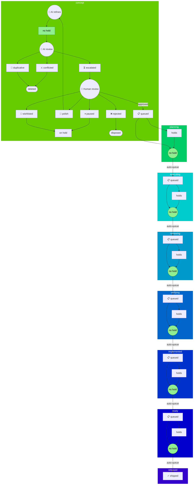

# Three-Field Workflow Model

Visual representations of the stage, hold, and disposition states used by the story-tree system.

---

## Definitions

| Term | Definition |
|------|------------|
| **Story node** | A unit of work in the hierarchical backlog—can be an epic, feature, capability, or task depending on depth. May have its own direct work AND children simultaneously. |

---
Stories progress through stages, with holds and dispositions as orthogonal states:

| Stage | Definition |
|-------|------------|
| **concept** | New idea proposed |
| **planning** | Implementation being planned; dependencies being verified |
| **executing** | Own code in progress; children's code in progress |
| **reviewing** | Own code under review; reviewing child code |
| **verifying** | Own implementation being tested; verifying integration with children |
| **implemented** | Own code complete; all children implemented and integrated |
| **ready** | Own work fully tested; entire subtree fully tested |
| **released** | Shipped |

---

| Hold States | Definition |
|------|------------|
| *(no hold)* | Story is not blocked and can progress |
| **🔥 broken** | Implementation has issues |
| **⚔ conflicted** | Scope overlaps another story |
| **🚧 blocked** | External dependency missing (not a choice to stop) |
| **⏳ escalated** | Requires human decision |
| **⏸ paused** | Intentionally stopped (not blocked by external factors) |
| **💎 polish** | Minor refinements before progressing |
| **📋 queued** | Awaiting automated processing |
| **💭 wishlisted** | Low priority, indefinite deferral |

---

| Dispositions | Definition |
|-------------|------------|
| *(not disposed)* | Story remains active in the tree |
| **🚫 infeasible** | Cannot be built |
| **❌ rejected** | Explicitly declined |
| **👯 duplicative** | Duplicate of another story |
| **⚠️ deprecated** | No longer recommended |
| **🛑 legacy** | Outdated or superseded |
| **📦 archived** | Stored away for reference |

---

## Stage Transitions

Holds gate progression within each stage. Clearing all holds triggers automatic transition to the next stage's queue.

**Key principle:** "No hold" in any stage = ready to transition to the next stage's queue. The hold system is the universal gating mechanism.
