# Three-Field Workflow Model

Visual representations of the stage, hold, and disposition states used by the story-tree system.

---

## Definitions

| Term | Definition |
|------|------------|
| **Story node** | A unit of work in the hierarchical backlog—can be an epic, feature, capability, or task depending on depth. May have its own direct work AND children simultaneously. |

---

## Stage

Stories progress through stages, with holds and dispositions as orthogonal states:

---

## Hold Status

```mermaid
flowchart TB
    root((No hold))

    broken[🔥 broken]
    broken_desc[Implementation has issues]

    conflicted[⚔ conflicted]
    conflicted_desc[Scope overlaps another story]

    blocked[🚧 blocked]
    blocked_desc[External dependency missing]
    blocked_not[Not a choice to stop]

    escalated[⏳ escalated]
    escalated_desc[Requires human decision]

    paused[⏸ paused]
    paused_desc[Intentionally stopped]
    paused_not[Not blocked by external factors]

    polish[💎 polish]
    polish_desc[Minor refinements before progressing]

    queued[📋 queued]
    queued_desc[Awaiting automated processing]

    wishlisted[💭 wishlisted]
    wishlisted_desc[Low priority, indefinite deferral]

    root --> broken --> broken_desc
    root --> conflicted --> conflicted_desc
    root --> blocked --> blocked_desc --> blocked_not
    root --> escalated --> escalated_desc
    root --> paused --> paused_desc --> paused_not
    root --> polish --> polish_desc
    root --> queued --> queued_desc
    root --> wishlisted --> wishlisted_desc

    classDef nohold fill:#888888,stroke:#666,color:#fff
    classDef brokenStyle fill:#CC4400,stroke:#AA3700,color:#fff
    classDef conflictedStyle fill:#D25B00,stroke:#B04D00,color:#fff
    classDef blockedStyle fill:#DB7100,stroke:#B95E00,color:#fff
    classDef escalatedStyle fill:#E28B00,stroke:#C07600,color:#000
    classDef pausedStyle fill:#E4A000,stroke:#C28800,color:#000
    classDef polishStyle fill:#E6B200,stroke:#C49600,color:#000
    classDef queuedStyle fill:#E8C200,stroke:#C6A300,color:#000
    classDef wishlistedStyle fill:#EAD000,stroke:#C8B100,color:#000

    class root nohold
    class broken,broken_desc brokenStyle
    class conflicted,conflicted_desc conflictedStyle
    class blocked,blocked_desc,blocked_not blockedStyle
    class escalated,escalated_desc escalatedStyle
    class paused,paused_desc,paused_not pausedStyle
    class polish,polish_desc polishStyle
    class queued,queued_desc queuedStyle
    class wishlisted,wishlisted_desc wishlistedStyle
```

---

## Disposition

```mermaid
flowchart TB
    root((Not disposed))

    infeasible[🚫 infeasible]
    infeasible_desc[Cannot be built]

    rejected[❌ rejected]
    rejected_desc[Explicitly declined]

    duplicative[👯 duplicative]
    duplicative_desc[Duplicate of another story]

    deprecated[⚠️ deprecated]
    deprecated_desc[No longer recommended]

    legacy[🛑 legacy]
    legacy_desc[Outdated or superseded]

    archived[📦 archived]
    archived_desc[Stored away for reference]

    root --> infeasible --> infeasible_desc
    root --> rejected --> rejected_desc
    root --> duplicative --> duplicative_desc
    root --> deprecated --> deprecated_desc
    root --> legacy --> legacy_desc
    root --> archived --> archived_desc

    classDef notDisposed fill:#9900CC,stroke:#7700AA,color:#fff
    classDef terminalStyle fill:#CC0000,stroke:#AA0000,color:#fff

    class root notDisposed
    class infeasible,infeasible_desc,rejected,rejected_desc,duplicative,duplicative_desc,deprecated,deprecated_desc,legacy,legacy_desc,archived,archived_desc terminalStyle
```

---

## Stage Transitions

Holds gate progression within each stage. Clearing all holds triggers automatic transition to the next stage's queue.

**Key principle:** "No hold" in any stage = ready to transition to the next stage's queue. The hold system is the universal gating mechanism.
