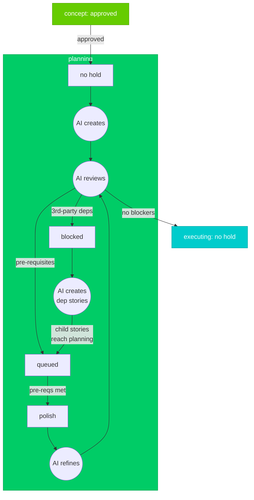

# Planning Stage

> For definitions of stages, holds, and dispositions, see @workflow-three-field-model.md

---

## Stage Diagram

---

## Workflow Description

### Entry
Stories enter planning with **no hold** after human approval in concept stage.

### AI Create Phase
AI creates TDD implementation plan:

1. **Research codebase** - Understand existing architecture, patterns, and conventions
2. **Draft TDD plan** - Write test scenarios first, then implementation steps
3. **Generate plan file** - Output structured plan with file paths and code examples

### AI Review Phase
AI reviews the plan for dependency issues:

1. **Check third-party dependencies** - Does this plan require libraries, APIs, or external services not yet available?
2. **Check pre-requisite stories** - Does this plan depend on other stories being implemented first?

### AI Creates Dependency Stories Phase
When a story is blocked due to third-party dependencies:

1. **Create child stories** - AI creates child story-nodes for installing/configuring each 3rd-party dependency
2. **Document requirements** - Each child story captures the specific dependency installation steps
3. **Convert to pre-requisites** - Once all child stories reach planning stage, the dependency is no longer "third-party" but a documented pre-requisite story

This transforms external blockers into internal, trackable work items.

### Hold Outcomes

| Hold | Trigger | Resolution |
|------|---------|------------|
| **blocked** | Third-party dependencies (libraries, APIs, external services) | AI creates child stories for each dependency; when all child stories reach `planning` stage, story moves to `queued` |
| **queued** | Pre-requisite stories identified (or converted from blocked) | Automatic—when all pre-requisite stories reach `implemented` or later, story moves to `polish` |
| **polish** | Pre-requisites satisfied | AI refines plan to incorporate completed pre-requisites, then re-reviews |

### Exit
When AI review finds no blockers → story moves to executing stage with **no hold**.
