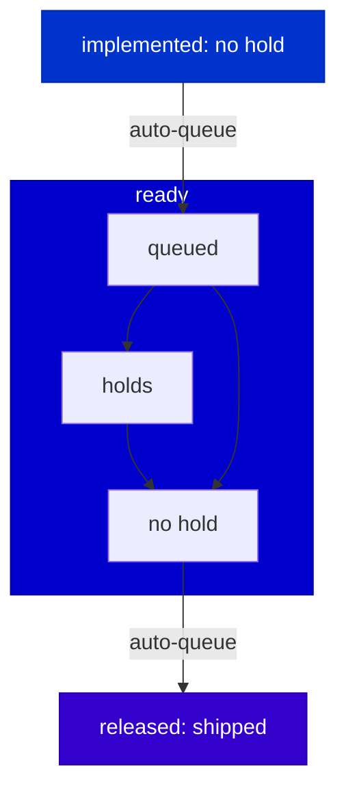

# Ready Stage

> For definitions of stages, holds, and dispositions, see @workflow-three-field-model.md

---

## Stage Diagram

```mermaid
flowchart TB
    implemented[implemented: no hold] -->|auto-queue| rd_q

    subgraph ready_stage [ready]
        rd_q[queued]
        rd_h[holds]
        rd_clear[no hold]
        rd_q --> rd_h
        rd_h --> rd_clear
        rd_q --> rd_clear
    end

    rd_clear -->|auto-queue| released[released: shipped]

    classDef implementedBox fill:#0033CC,stroke:#0029A3,color:#fff
    classDef readyBox fill:#0000CC,stroke:#0000A3,color:#fff
    classDef releasedBox fill:#3300CC,stroke:#2900A3,color:#fff
    class implemented implementedBox
    class ready_stage readyBox
    class released releasedBox
```
